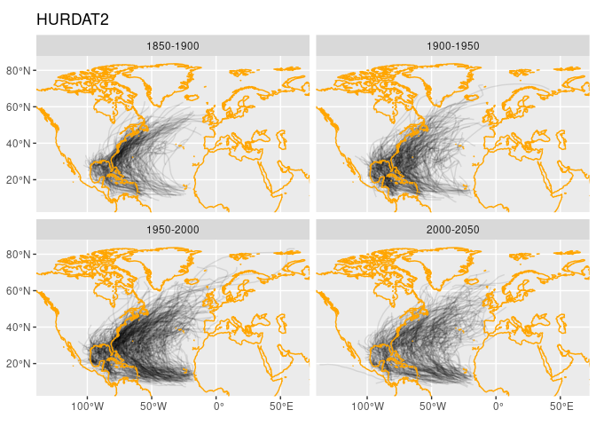

HURDAT2
================

An R package for accessing NOAA’s [HURDAT2 hurricane data]().

### Requirements

- [R v4.2+](https://www.r-project.org/)

- [rlang](https://CRAN.R-project.org/package=rlang)

- [dplyr](https://CRAN.R-project.org/package=dplyr)

- [readr](https://CRAN.R-project.org/package=readr)

- [sf](https://CRAN.R-project.org/package=sf)

- [ggplot2](https://CRAN.R-project.org/package=ggplot2)

- [colorspace](https://CRAN.R-project.org/package=colorspace)

# Installation

    remotes::install_github("BigelowLab/hurdat2")

# Useage

``` r
suppressPackageStartupMessages({
  library(sf)
  library(dplyr)
  library(hurdat2)
})
```

Read as POINT data (one obseravtion per row).

``` r
x = read_hurdat(form = "observations") |>
  glimpse()
```

    ## Rows: 55,605
    ## Columns: 21
    ## $ id              <chr> "AL011851", "AL011851", "AL011851", "AL011851", "AL011…
    ## $ name            <chr> "UNNAMED", "UNNAMED", "UNNAMED", "UNNAMED", "UNNAMED",…
    ## $ datetime        <dttm> 1851-06-24 19:03:58, 1851-06-25 01:03:58, 1851-06-25 …
    ## $ record_id       <chr> NA, NA, NA, NA, "L", NA, NA, NA, NA, NA, NA, NA, NA, N…
    ## $ sys_status      <chr> "HU", "HU", "HU", "HU", "HU", "HU", "TS", "TS", "TS", …
    ## $ wind_max_sus    <dbl> 80, 80, 80, 80, 80, 70, 60, 60, 50, 50, 40, 40, 40, 40…
    ## $ min_pres        <dbl> NA, NA, NA, NA, NA, NA, NA, NA, NA, NA, NA, NA, NA, NA…
    ## $ wind_34kt_ne    <dbl> NA, NA, NA, NA, NA, NA, NA, NA, NA, NA, NA, NA, NA, NA…
    ## $ wind_34kt_se    <dbl> NA, NA, NA, NA, NA, NA, NA, NA, NA, NA, NA, NA, NA, NA…
    ## $ wind_34kt_sw    <dbl> NA, NA, NA, NA, NA, NA, NA, NA, NA, NA, NA, NA, NA, NA…
    ## $ wind_34kt_nw    <dbl> NA, NA, NA, NA, NA, NA, NA, NA, NA, NA, NA, NA, NA, NA…
    ## $ wind_50kt_ne    <dbl> NA, NA, NA, NA, NA, NA, NA, NA, NA, NA, NA, NA, NA, NA…
    ## $ wind_50kt_se    <dbl> NA, NA, NA, NA, NA, NA, NA, NA, NA, NA, NA, NA, NA, NA…
    ## $ wind_50kt_sw    <dbl> NA, NA, NA, NA, NA, NA, NA, NA, NA, NA, NA, NA, NA, NA…
    ## $ wind_50kt_nw    <dbl> NA, NA, NA, NA, NA, NA, NA, NA, NA, NA, NA, NA, NA, NA…
    ## $ wind_64kt_ne    <dbl> NA, NA, NA, NA, NA, NA, NA, NA, NA, NA, NA, NA, NA, NA…
    ## $ wind_64kt_se    <dbl> NA, NA, NA, NA, NA, NA, NA, NA, NA, NA, NA, NA, NA, NA…
    ## $ wind_64kt_sw    <dbl> NA, NA, NA, NA, NA, NA, NA, NA, NA, NA, NA, NA, NA, NA…
    ## $ wind_64kt_nw    <dbl> NA, NA, NA, NA, NA, NA, NA, NA, NA, NA, NA, NA, NA, NA…
    ## $ wind_max_radius <dbl> NA, NA, NA, NA, NA, NA, NA, NA, NA, NA, NA, NA, NA, NA…
    ## $ geom            <POINT [°]> POINT (-94.8 28), POINT (-95.4 28), POINT (-96 2…

Read as LINESTRING data (one storm per row)

``` r
x = read_hurdat(form = "storms") |>
  glimpse()
```

    ## Rows: 2,004
    ## Columns: 22
    ## $ id              <chr> "AL011851", "AL011852", "AL011853", "AL011854", "AL011…
    ## $ name            <chr> "UNNAMED", "UNNAMED", "UNNAMED", "UNNAMED", "UNNAMED",…
    ## $ start           <dttm> 1851-06-24 19:03:58, 1852-08-18 19:03:58, 1853-08-05 …
    ## $ end             <dttm> 1851-06-27 19:03:58, 1852-08-29 19:03:58, 1853-08-05 …
    ## $ duration        <dbl> 4, 12, 1, 3, 1, 4, 2, 1, 1, 9, 7, 3, 2, 3, 1, 6, 3, 5,…
    ## $ n               <int> 14, 45, 1, 11, 1, 14, 8, 1, 1, 35, 28, 12, 8, 12, 1, 1…
    ## $ wind_max_sus    <dbl> 60, 80, 50, 60, 90, 85, 50, 70, 90, 50, 65, 50, 75, 70…
    ## $ min_pres        <dbl> NA, NA, NA, NA, NA, NA, NA, NA, NA, NA, NA, NA, NA, NA…
    ## $ wind_34kt_ne    <dbl> NA, NA, NA, NA, NA, NA, NA, NA, NA, NA, NA, NA, NA, NA…
    ## $ wind_34kt_se    <dbl> NA, NA, NA, NA, NA, NA, NA, NA, NA, NA, NA, NA, NA, NA…
    ## $ wind_34kt_sw    <dbl> NA, NA, NA, NA, NA, NA, NA, NA, NA, NA, NA, NA, NA, NA…
    ## $ wind_34kt_nw    <dbl> NA, NA, NA, NA, NA, NA, NA, NA, NA, NA, NA, NA, NA, NA…
    ## $ wind_50kt_ne    <dbl> NA, NA, NA, NA, NA, NA, NA, NA, NA, NA, NA, NA, NA, NA…
    ## $ wind_50kt_se    <dbl> NA, NA, NA, NA, NA, NA, NA, NA, NA, NA, NA, NA, NA, NA…
    ## $ wind_50kt_sw    <dbl> NA, NA, NA, NA, NA, NA, NA, NA, NA, NA, NA, NA, NA, NA…
    ## $ wind_50kt_nw    <dbl> NA, NA, NA, NA, NA, NA, NA, NA, NA, NA, NA, NA, NA, NA…
    ## $ wind_64kt_ne    <dbl> NA, NA, NA, NA, NA, NA, NA, NA, NA, NA, NA, NA, NA, NA…
    ## $ wind_64kt_se    <dbl> NA, NA, NA, NA, NA, NA, NA, NA, NA, NA, NA, NA, NA, NA…
    ## $ wind_64kt_sw    <dbl> NA, NA, NA, NA, NA, NA, NA, NA, NA, NA, NA, NA, NA, NA…
    ## $ wind_64kt_nw    <dbl> NA, NA, NA, NA, NA, NA, NA, NA, NA, NA, NA, NA, NA, NA…
    ## $ wind_max_radius <dbl> NA, NA, NA, NA, NA, NA, NA, NA, NA, NA, NA, NA, NA, NA…
    ## $ geom            <LINESTRING [°]> LINESTRING (-94.8 28, -95.4..., LINESTRING …

Show a map of the storm track data - grouped by 50-year interval groups.

``` r
map_hurdat(x, epoch = 50)
```

<!-- -->
